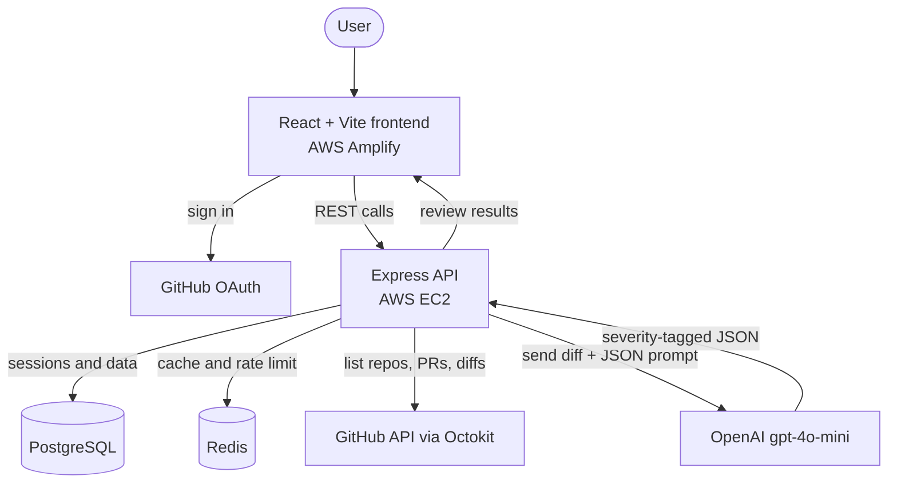

<div align="center">

# AI Code Review Assistant

### Connect your GitHub account, pick an open pull request, and get an instant AI review with severity-tagged findings

[](https://main.d3dm91k4g9mtr9.amplifyapp.com/)
[](https://nodejs.org/)
[](https://react.dev/)
[](https://vitejs.dev/)
[](https://openai.com/)
[](https://redis.io/)
[](https://www.postgresql.org/)
[](https://www.docker.com/)
[](LICENSE)

</div>

---

## Demo

**Live app:** https://main.d3dm91k4g9mtr9.amplifyapp.com/

<!-- ADD YOUR DEMO VIDEO HERE.
     Easiest way to host a video on GitHub:
     1. Record a 60-90s screen capture (.mp4) showing login, picking a PR, and the review appearing.
     2. Open a new GitHub Issue in this repo and drag the .mp4 into the comment box.
     3. GitHub uploads it and gives you a URL. Copy that URL and paste it below, then close the issue (the video stays hosted).
     For images: save them in docs/screenshots/ and uncomment the table below. -->

A short walkthrough video is coming soon.

<!--
| Connect GitHub | Pick a pull request | AI review with severity badges |
|:---:|:---:|:---:|
|  |  |  |
-->

---

## What is this, in plain English?

Code review is one of the slowest steps in shipping software. Pull requests often sit for a day or more waiting for a human to look at them.

This app gives you a first-pass review in seconds. You sign in with your GitHub account, choose one of your open pull requests, and the app reads the code changes and returns a structured review: each finding has a severity (critical, high, medium, low), a category (security, performance, logic, style), an explanation, and where possible a suggested fix. It is meant to catch the obvious issues quickly so human reviewers can focus on the harder ones.

---

## Why it's interesting

The interesting parts are less about the AI call and more about building a reliable product around it:

- **Real GitHub login.** Authentication uses GitHub OAuth (Passport), and sessions are stored in PostgreSQL, so a login survives a server restart.
- **Structured output from the model.** Instead of free-form text, the app asks `gpt-4o-mini` for a strict JSON shape (severity, category, message, suggestion). That makes the results predictable enough to render as a real UI.
- **Cost and abuse protection.** The review endpoint is the expensive one, so it is rate limited per user using Redis. If Redis is briefly unavailable, the limiter fails open rather than taking the whole app down.
- **Handling large diffs.** Pull requests can be big. The app validates and trims diffs that would not fit the model's context window instead of failing outright.
- **Caching.** Past reviews are stored and served quickly so re-opening a PR does not pay the cost again.
- **Sensible security defaults.** Helmet for headers and a CORS allowlist for the frontend origin.

---

## Architecture



The flow: you sign in through GitHub OAuth, the frontend calls the Express API, the API pulls your repositories and pull requests from the GitHub API, fetches the diff for the PR you choose, sends it to the model with a JSON output format, stores the result in PostgreSQL, caches it in Redis, and returns the findings to the UI.

---

## Tech Stack

| Layer | Technology |
|---|---|
| Frontend | React 19, Vite 8 (hosted on AWS Amplify) |
| Backend | Node.js, Express 5 (deployed on AWS EC2) |
| AI | OpenAI `gpt-4o-mini` (JSON response format) |
| Auth | GitHub OAuth via Passport, sessions in PostgreSQL |
| Database | PostgreSQL 15 |
| Cache and rate limiting | Redis 7 (ioredis) |
| GitHub integration | Octokit REST |
| Security | Helmet, CORS allowlist |
| Packaging | Docker, Docker Compose |
| Deployment | Frontend on AWS Amplify, backend API on AWS EC2 |

---

## Getting Started

### Prerequisites
- Node.js 18 or newer
- Docker and Docker Compose (for PostgreSQL and Redis)
- A GitHub OAuth app (Client ID and Secret)
- An OpenAI API key

### 1. Backend setup
```bash
npm install
cp .env.example .env     # then fill in the values (see the table below)
docker compose up -d     # starts PostgreSQL and Redis
npm run migrate          # creates the database tables
npm run dev              # starts the API
```
The API runs on the port set by `PORT` (for example, http://localhost:8080).

### 2. Frontend setup
```bash
cd client
npm install
npm run dev              # starts the React app on http://localhost:5173
```

---

## Environment Variables

| Variable | Description |
|---|---|
| `PORT` | Port the API listens on |
| `NODE_ENV` | `development` or `production` |
| `CLIENT_URL` / `CLIENT_URLS` | Allowed frontend origin(s) for CORS |
| `DATABASE_URL` *or* `DB_HOST`, `DB_PORT`, `DB_NAME`, `DB_USER`, `DB_PASSWORD` | PostgreSQL connection |
| `REDIS_URL` | Redis connection |
| `GITHUB_CLIENT_ID` / `GITHUB_CLIENT_SECRET` | GitHub OAuth app credentials |
| `CALLBACK_URL` | GitHub OAuth callback URL |
| `OPENAI_API_KEY` | OpenAI API key |
| `SESSION_SECRET` | Secret used to sign the session cookie |
| `SESSION_COOKIE_NAME` / `SESSION_COOKIE_SECURE` / `SESSION_COOKIE_SAME_SITE` | Session cookie settings |

---

## API Reference

**Auth**

| Method | Endpoint | What it does |
|---|---|---|
| `GET` | `/auth/github` | Start the GitHub OAuth login |
| `GET` | `/auth/callback` | OAuth callback that sets the session |
| `GET` | `/auth/me` | Get the currently logged-in user |
| `POST` | `/auth/logout` | Log out and clear the session |

**Repositories** (base `/api/v1/repositories`)

| Method | Endpoint | What it does |
|---|---|---|
| `GET` | `/` | List your saved repositories |
| `GET` | `/github` | List your repositories from GitHub |
| `POST` | `/` | Add a repository to track |
| `DELETE` | `/:id` | Remove a tracked repository |

**Reviews** (base `/api/v1/reviews`)

| Method | Endpoint | What it does |
|---|---|---|
| `GET` | `/` | List past reviews |
| `GET` | `/:id` | Get a single review |
| `POST` | `/` | Create a review record |
| `POST` | `/fetch-pr` | Fetch a pull request's diff |
| `POST` | `/:id/process` | Run the AI review on a stored PR (rate limited) |

A top-level `GET /health` endpoint reports service health.

---

## Project Structure

```
.
├── src/
│   ├── index.js        # Express app setup and middleware
│   ├── routes/         # auth, repositories, reviews
│   ├── services/       # OpenAI service, GitHub service
│   ├── middleware/     # auth guard, rate limiter
│   └── db/             # migrations and queries
├── client/             # React + Vite frontend
├── docker-compose.yml  # PostgreSQL + Redis
└── Dockerfile
```

---

## What I Learned

This project was about building a dependable product around a language model, not just calling one. The lessons that stuck: getting structured, predictable output from a model, protecting an expensive endpoint with rate limiting that fails safely, persisting OAuth sessions, working within a model's context limits, and caching to keep costs and latency down.

---

## Author

**Pubudu Gunasekara**
M.S. Computer Science, Northeastern University (Silicon Valley)
Backend and distributed systems. Open to a software engineering co-op (Jan to Aug 2027).

[](https://pubudugunasekara.github.io/)
[](https://www.linkedin.com/in/pubudugunasekera/)
[](https://github.com/PubuduGunasekara)

---

<div align="center">

**Thanks for checking out this project.**
If you found it useful or interesting, consider leaving a star, and feel free to reach out about backend, distributed systems, or co-op opportunities.

Built by Pubudu Gunasekara · MIT License

</div>
